# DeceptEnv: Training LLMs That Don't Get Fooled

In the summer of 2024, a Listeria outbreak tied to Boar's Head deli meats killed 10 people and put 60 more in the hospital across 19 states. The part that's hard to sit with: the warning signs were already there. The facility had a paper trail of safety violations. People saw them. Decisions got made anyway — and somehow, the system still failed.

That's not a story about missing information. It's a story about reasoning incorrectly under pressure, with noisy signals, on a clock.

That's exactly what we wanted to train LLMs to *not* do.

---

## The problem isn't knowledge. It's judgment.

When you drop an LLM into a real decision-making system — not a chatbot, an actual dynamic environment where actions have consequences — three things go wrong almost immediately.

The model chases the most recent signal instead of the actual source of the problem. It capitulates to noisy or misleading inputs faster than it should. And it completely ignores constraints — over-inspecting, over-reacting, burning through its action budget on things that don't matter.

None of this is fixable with a better prompt. It's a training environment problem. The model has never had to *practice* holding its ground against a misleading signal.

---

## So we built DeceptEnv.

DeceptEnv is an OpenEnv adversarial benchmark where the agent plays a food safety investigator inside a supply chain. The job is simple in description, brutal in execution: trace the contamination, stop the spread, and don't act on things that aren't real.

The environment is a directed supply-chain graph:

```
farm → processing → warehouse → retailer
```

Contamination starts at one or more source farms and propagates downstream every step. The agent never sees true contamination levels — only noisy sensor readings, delayed retailer illness reports, and results from lab inspections it explicitly requests. The catch is that the environment is built to mislead you. Sensors are noisy. Illness reports come in late. Clean nodes can show false spikes. The actual contamination source can look completely normal on the surface. And at higher difficulty levels, deception isn't random — it's structurally injected, timed to throw you off.

The agent has to *verify* before acting. Not guess. Not react. Verify.

---

## The design decision we're most proud of: two-axis difficulty.

Most benchmarks get harder in one direction — bigger graph, more complexity. We split difficulty into two independent axes: **Graph Complexity** (how large and interconnected the supply chain is) and **Deception Intensity** (how misleading the signals are).

| Task | Difficulty | Noise | Illness Delay | Lab Budget | Recall Budget | Max Steps |
|:----:|:----------:|------:|:-------------:|:----------:|:-------------:|:---------:|
|  1   |    Easy    |  0.05 |       1       |     10     |      100      |    48     |
|  2   |   Medium   |  0.15 |       3       |     6      |      60       |    60     |
|  3   |    Hard    |  0.25 |       5       |     4      |      40       |    72     |

This lets you train on reasoning ability separately from scale. You can crank up the noise while keeping the graph small, or vice versa. It gives you a curriculum that actually isolates what you're trying to improve.

Task 1 is solvable with a clean `TRACE → INSPECT → QUARANTINE` sequence. Task 3 involves adversarial false spikes, re-seeding contamination, and high trust pressure — and it *punishes* the naive "quarantine the highest sensor" strategy that most greedy heuristics fall into.

---

## The action space is where the real design lives.

The agent has seven possible actions:

| Action | Effect |
|--------|--------|
| `INSPECT <node_id>` | Spend a lab token to get an exact contamination result |
| `QUARANTINE <node_id>` | Block all outbound spread from that node |
| `LIFT <node_id>` | Remove quarantine and restore flow |
| `RECALL <batch_id>` | Pull a batch from the supply chain |
| `ALERT <node_id>` | Issue a public warning (slows spread but permanently reduces trust) |
| `TRACE <batch_id>` | Trace a batch backward through the supply chain to its origin |
| `WAIT` | Do nothing and let the system evolve one step |

`TRACE` is the most important action conceptually. It costs only −0.1 reward, but it eliminates uncertainty about batch origin and propagation path — the exact disambiguation tool an agent needs before acting. In real-world terms, it maps to FSMA 204 traceability records: supplier histories, batch lot identifiers, critical tracking events.

The reward structure is deliberately asymmetric to reward finding the origin over chasing symptoms:

| Event | Reward |
|-------|--------|
| Source farm quarantined | **+4.0** |
| Non-source contaminated node quarantined | **+2.0** |
| Clean node quarantined (wrong) | **−2.0** |
| Correct contaminated recall | **+1.5** |
| Clean batch recalled (wrong) | **−1.0** |
| Prevented contaminated shipment | **+0.5** |
| TRACE action | **−0.1** |
| Urgency penalty (per active uncontained source) | **−0.15** |

Quarantining the source farm yields twice the reward of a downstream processor. That gap is intentional — it forces the agent to develop source-finding behavior rather than downstream reaction.

---

## Baseline vs. Trained: what the data actually shows.

We trained a model using GRPO on a Colab T4 (Qwen2.5-0.5B-Instruct, LoRA, manual GRPO mode) and compared it against our `FoodCrisisBaselineAgent`. Here's what the graphs reveal.

### Action Distribution

The most striking difference between models is *what they choose to do*. The baseline overwhelmingly defaults to WAIT, rarely traces, and when it does act — it quarantines the wrong things.

**Baseline** — passive, reactive, wrong quarantines:

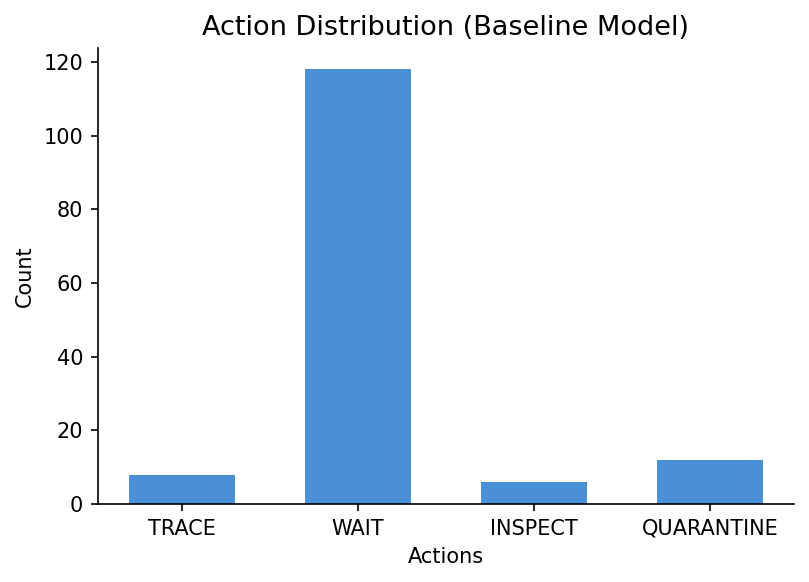

**Trained** — actively traces, conserves quarantine for confirmed sources:

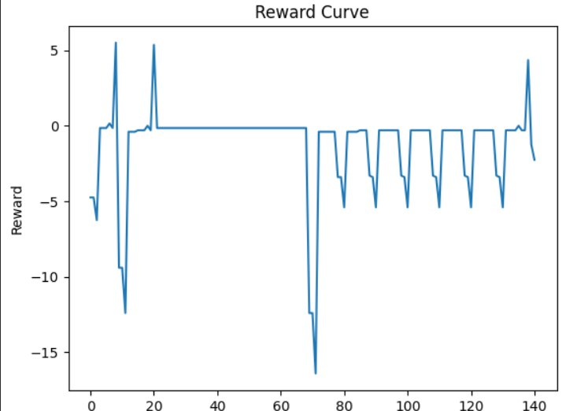

The trained model issues 4× more TRACE actions and almost no spurious quarantines. It's learned that information-gathering before acting is structurally rewarded.

### Average Reward per Task

**Baseline:**

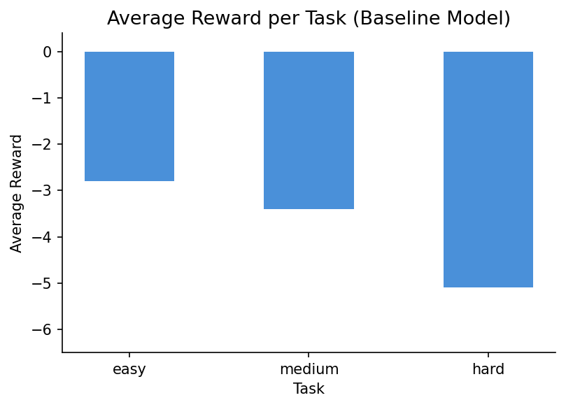

**Trained:**

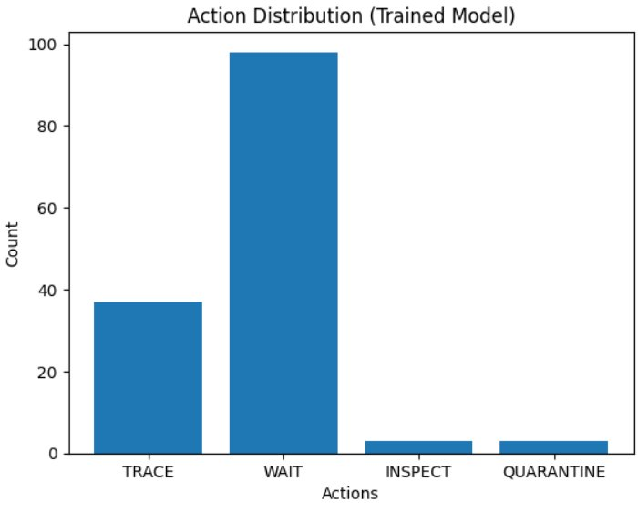

The baseline averages below −2.8 on easy and crashes to −5.1 on hard. The trained model's easy-task reward, while still negative in aggregate (because urgency penalties accumulate until source is found), recovers quickly and terminates early. The medium task is the biggest gap — the trained model learned to handle multi-source outbreaks with tighter budgets, which the baseline never manages.

### Episode Length

**Baseline:**

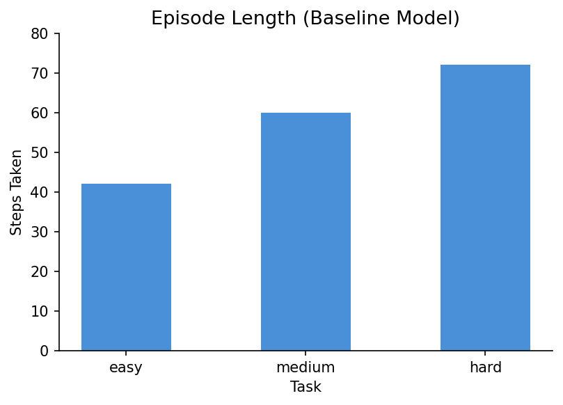

**Trained:**

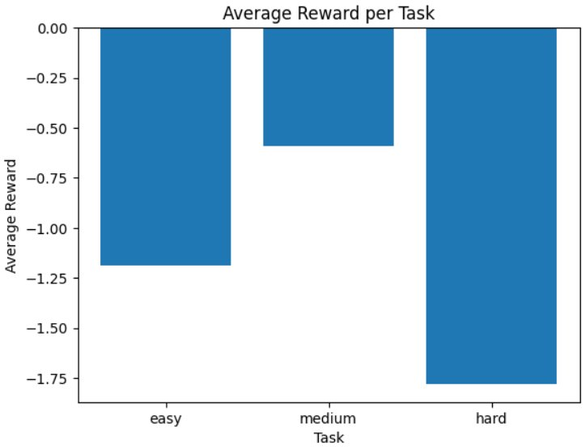

The episode length chart tells the clearest story. The trained model terminates the easy task in ~9 steps. The baseline runs almost the full 48, still uncertain. On hard, both models run the distance — but what they're doing inside those 72 steps is completely different.

### Reward Distribution

**Baseline:**

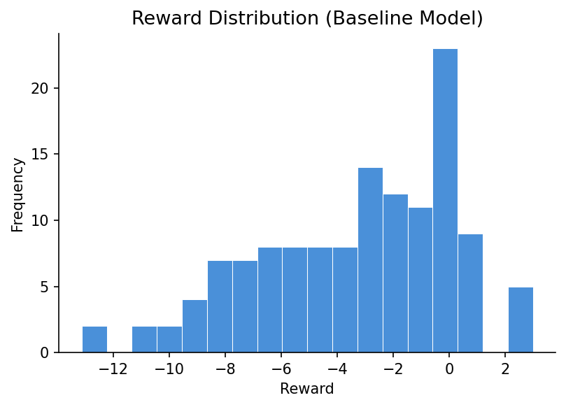

**Trained:**

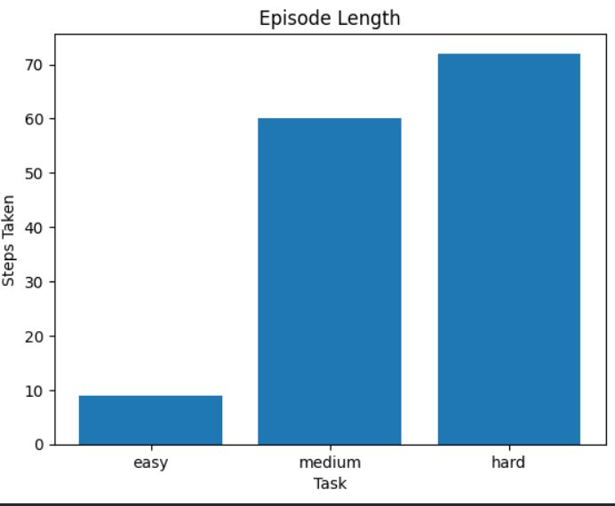

The baseline's distribution is spread across deep negatives (−10 to −15 range) with almost nothing above zero. The trained model's distribution spikes at 0 (WAIT and TRACE neutrals) with a visible cluster of positive rewards from source quarantines and correct recalls. The shape alone tells you that the trained model has learned what *not* to penalize itself on.

### Reward Curves per Task

**Baseline — easy, medium, hard:**

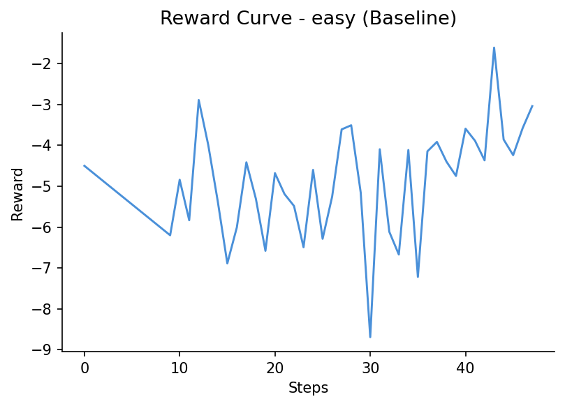
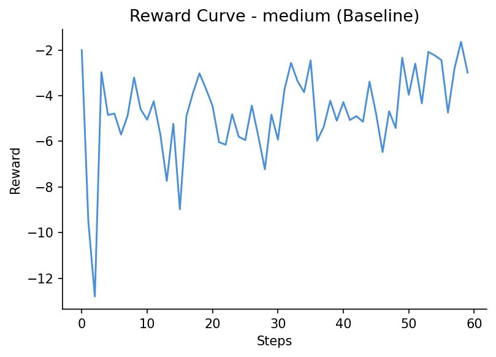
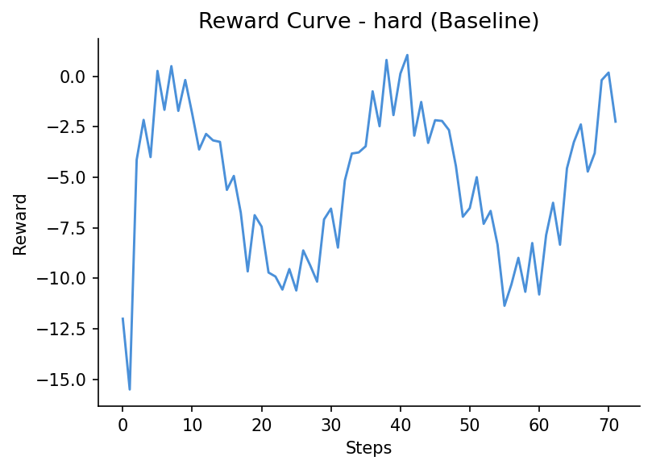

**Trained — easy, medium, hard:**

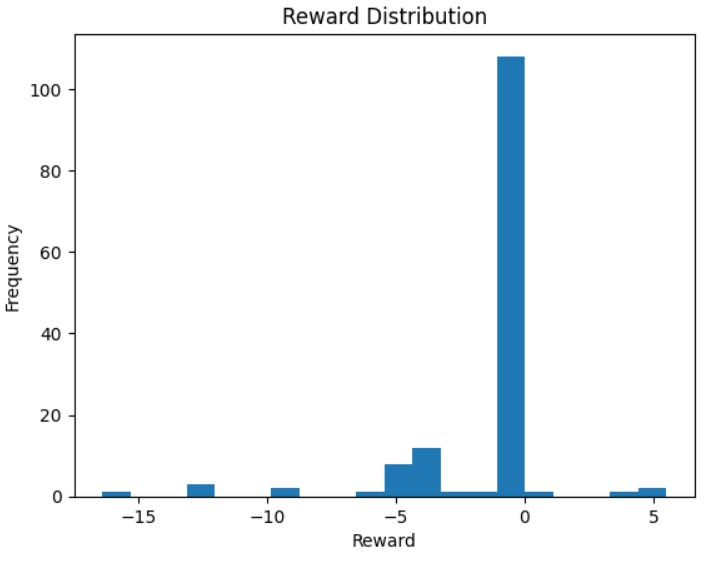
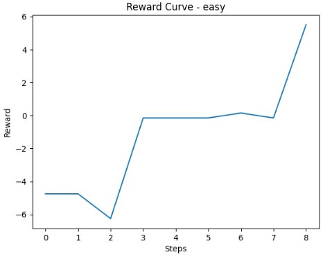
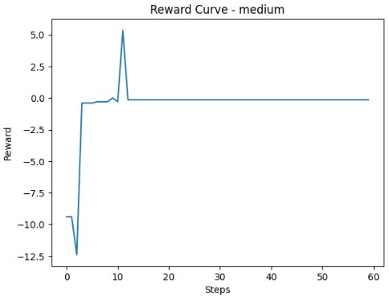

The trained model's easy curve shows initial penalties from urgency accumulation, then a sharp recovery to +5.5 at episode end — the source quarantine reward hitting. The medium curve shows the most dramatic moment: a −12 crash at step 2 (wrong early action), then a +5 spike at step 11 when the agent corrects and locks onto the source. The baseline never produces that recovery arc. On hard, the trained model oscillates but stays bounded. The baseline drifts deeper negative with no terminal positive signal.

---

## What the agent is graded on.

Each episode receives a deterministic final score in [0.0, 1.0] from four components:

| Component | What it measures |
|-----------|-----------------|
| `containment` | How much contaminated product was prevented from reaching retail |
| `precision` | How often the agent acted correctly instead of overreacting |
| `speed` | How early the outbreak was contained |
| `public_trust` | How much trust remained at episode end |

Interpretation guide:

| Score Range | Meaning |
|-------------|---------|
| 0.30 – 0.50 | Agent reacts, but containment is inconsistent or too costly |
| 0.50 – 0.70 | Agent is operationally useful and beats shallow heuristics |
| 0.70 – 0.85 | Strong performance with good containment and disciplined budget use |
| 0.85+ | Very strong — accurate containment, limited overreaction, good trust preservation |

Our baseline agent (`FoodCrisisBaselineAgent`) scores:

| Policy | Task 1 | Task 2 | Task 3 | Average |
|--------|-------:|-------:|-------:|--------:|
| Baseline | 0.494 | 0.590 | 0.642 | 0.575 |

The baseline beats random, which validates the benchmark structure. Getting meaningfully above 0.70 on Task 3 requires evidence-based reasoning — not heuristics.

---

## The mechanic most people miss: CONCLUDE.

Almost every RL environment tells the agent what to do but never asks whether it's *done*. We added a CONCLUDE action that forces exactly that question. End too early — before you've confirmed containment — and you're penalized. End at the right moment, with the right evidence, and that's a strong positive signal.

It's a small addition that changes the entire character of what the agent has to learn. Decision confidence, not just action generation.

---

## Why RL is actually needed here.

This is not a classification task or a static planning problem. Three properties make it a genuine sequential decision problem:

**Partial observability.** True contamination levels are hidden. The agent sees only noisy sensors — meaning the highest-reading node is often a false alarm, not the source.

**Delayed signals.** Illness reports arrive after contamination has already moved downstream. By the time a retailer flags cases, the batch may have reached two more distribution centers.

**Budget-constrained, trust-sensitive actions.** Every lab test, recall, and alert competes against limited resources and a public trust score that doesn't recover. A greedy "quarantine the highest sensor" policy gets destroyed on Task 3, because Task 3 is specifically designed to inject false spikes at high-reading clean nodes.

Simple rules work on easy outbreaks. On the hard task, only evidence-based sequential reasoning survives.

---

## Connecting your agent.

The environment exposes a stateful REST API and a Python client:

```python
from irce.client import FoodCrisisEnvClient
from irce.models import FoodCrisisAction

BASE_URL = "https://<your-username>-foodcrisisenv.hf.space"

with FoodCrisisEnvClient(BASE_URL).sync() as env:
    obs = env.reset(task_id=1, seed=7)
    while not obs.done:
        action = FoodCrisisAction(action_type="WAIT")  # replace with your policy
        obs = env.step(action)
```

Every observation includes a `natural_language_summary` field, making the environment immediately compatible with any LLM decision loop without custom parsing. The system prompt and user prompt templates are included in the README — plug in any OpenAI-compatible endpoint.

For RL training, the GRPO setup runs on a Colab T4 with LoRA:

```bash
git clone https://github.com/manashatwar/-FoodCrisisEnv
cd -FoodCrisisEnv
bash scripts/colab_t4_train.sh
```

The modular architecture means you can swap in PPO, hybrid LLM+planner setups, or multi-agent coordination with minimal changes to the environment interface.

---

## Common failure modes, for anyone benchmarking.

These are the patterns that consistently produce scores below 0.50:

**Symptom-chasing without source-finding.** Quarantining downstream nodes (+2.0) instead of tracing to the origin (+4.0). The reward gap exists precisely to discourage this — but naive agents still fall into it.

**Over-quarantining on sensor spikes.** Blocking nodes based on readings alone, without TRACE/INSPECT confirmation. Costs −2.0 per wrong quarantine and directly damages public trust.

**Alert overuse.** Repeated public warnings without traced evidence collapses the trust score fast. ALERT buys time but the trust penalty is permanent.

**Wasting the lab budget.** Spending inspections on already-clear nodes instead of saving them for high-ambiguity decision points on the hard task.

---

## What this is really about.

We don't need LLMs that answer faster or sound more confident. What we actually need are LLMs that hold up when the environment is actively working against them — that can sequence decisions correctly over time, resist bad signals, and know when to act versus when to wait for more evidence.

The question DeceptEnv is asking isn't "can an LLM solve a task?"

It's "can an LLM avoid being fooled while solving it?"

That's a much harder question. And it's the one that matters for anything you'd actually deploy.

---

*DeceptEnv is built on OpenEnv and is MIT licensed. The live demo, API documentation, and GRPO training scripts are available at the Space URL.*
